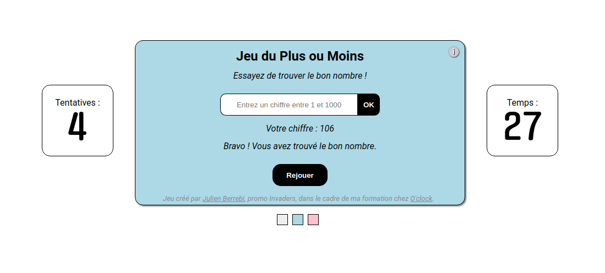

# Jeu du Plus ou Moins

## Contexte

Suite à la réalisation de ce jeu, dans le cadre de la découverte de JavaScript, avec des `prompt()`, `alert()`, `confirm()`, j'ai voulu créer une interface graphique à ce jeu.

## Objectif

Le but du jeu est le plus simple possible : *Trouver le bon nombre entre 1 et 1000*

Vous n'avez que 10 tentatives !

Impossible me direz-vous ? Les plus malins iront jeter un œil à la *Console* de leur navigateur et auront une belle surprise !

## Fonctionnalités

### Nouveauté v2
* Chrono en seconde qui indique le temps que vous mettez par partie (si jamais il dépasse 999 secondes, il s'adapte en taille pour rester dans son cadre).
* Compteur du nombre de tentatives restantes.
* Ajout de 3 carrés de couleur pour changer le background-color du jeu.
* Ajout d'un bouton Infos qui, au survol, affiche les informations du jeu (but, nombre de tentatives).
* Commentaires du code JavaScript
* Simplifications et nettoyages du code

-----------------

* Génération d'un nombre entier et aléatoire en 1 et 1000.
* Récupération de la valeur que valide l'utilisateur, analyse pour voir si elle est :
    * Non *null* ou vide
    * Bien un type *Number* et non un *String*
    * Supérieure à 1
    * Inférieure à 1000
* Gestion du nombre de tentatives.
* Indication à l'utilisateur si son nombre est plus grand ou plus petit ainsi que son nombre de tentatives.
* Apparition du bouton *Rejouer* en fin de partie pour faire un reset des propriétés et re-générer un nouveau nombre aléatoire.

## Remerciements

Code créé dans le cadre de ma formation de Développeur Web chez [O'clock](https://oclock.io/) (4ème jour de cours JavaScript).
